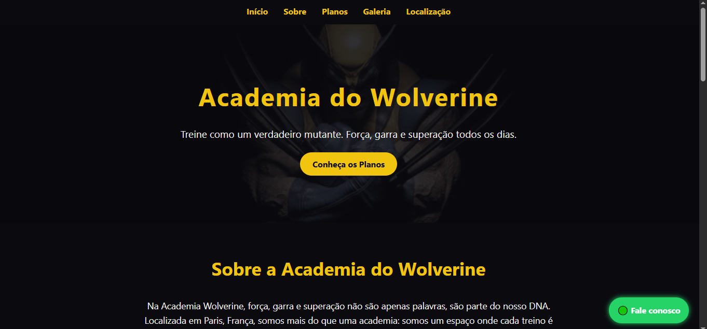

# 🐾 Academia do Wolverine

Site institucional fictício desenvolvido como projeto de portfólio, com foco em HTML, CSS e JavaScript. Inspirado no universo do Wolverine, o site apresenta uma academia com identidade visual forte, layout responsivo e seções bem organizadas.

---

## 📁 Estrutura do Projeto

```
PROJETO/
├── components/         # Seções HTML modulares
│   ├── hero.html
│   ├── sobre.html
│   ├── planos.html
│   ├── galeria.html
│   └── localizacao.html
├── css/
│   └── style.css       # Estilos principais
├── js/
│   └── script.js       # Scripts JS (se necessário)
├── images/             # Imagens do site
│   ├── wolverine1.jpg ... wolverine6.jpg
│   └── wolverinewall.jpg
└── home.html           # Página principal
```

## 📸 Preview


---

## 🛠️ Tecnologias Utilizadas

- **HTML5** — estrutura semântica
- **CSS3** — layout responsivo e estilização
- **JavaScript** — interações básicas
- **Google Maps Embed** — mapa interativo com localização
- **GitHub Pages** — hospedagem gratuita do projeto

---

## 🚀 Como Visualizar Localmente

1. Clone o repositório:
   ```bash
   git clone https://github.com/YakashiDev/academia-wolverine.git
   ```

2. Abra o arquivo `home.html` no navegador.

---

## 🌐 Como Publicar com GitHub Pages

1. Vá em **Settings > Pages** no repositório
2. Selecione a branch `main` e a pasta raiz `/`
3. O site estará disponível em:
   ```
   https://YakashiDev.github.io/academia-wolverine
   ```

---

## 📌 Funcionalidades

- Seção Hero com imagem de fundo personalizada
- Apresentação dos planos com layout em colunas responsivas
- Galeria de imagens com destaque visual
- Mapa interativo com localização da "academia"
- Botão de rota para o Google Maps:
  [📍 Ver no Google Maps](https://maps.app.goo.gl/YzgiYvug8hihixJp8)

---

## 📄 Licença

Este projeto é apenas para fins educacionais e de portfólio. Imagens e nomes utilizados são fictícios e sem fins comerciais.

---

## 🤝 Autor

Desenvolvido por **YakashiiDev**  
📍 Brasília, Brasil   
📧 yakashidev@gmail.com

---

## 💡 Inspiração

Este projeto foi inspirado na ideia de unir design criativo com estrutura técnica sólida, simulando um site real de academia com identidade visual marcante e navegação intuitiva.

```